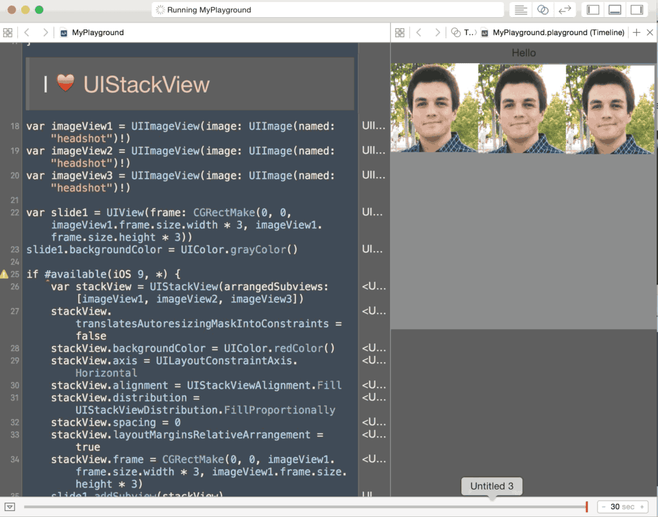
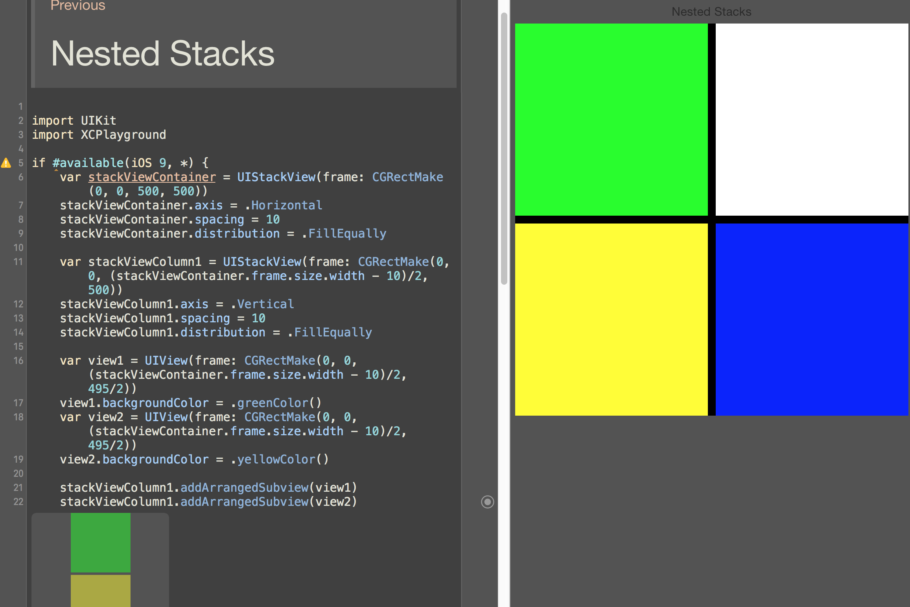

# UIStackView-Playground
A playground demonstrating some of the key features of UIStackView

[Follow me on Twitter @iAmChrisTruman](https://twitter.com/iAmChrisTruman) if you have stack view questions.
## All properties are animatable (Axis, Distribution, Hidden)

## Stack views can be 'nested' inside each other

## Stack views make Interface Builder Simple

UIStackView has been backported to iOS 7 here:

https://github.com/oarrabi/OAStackView
